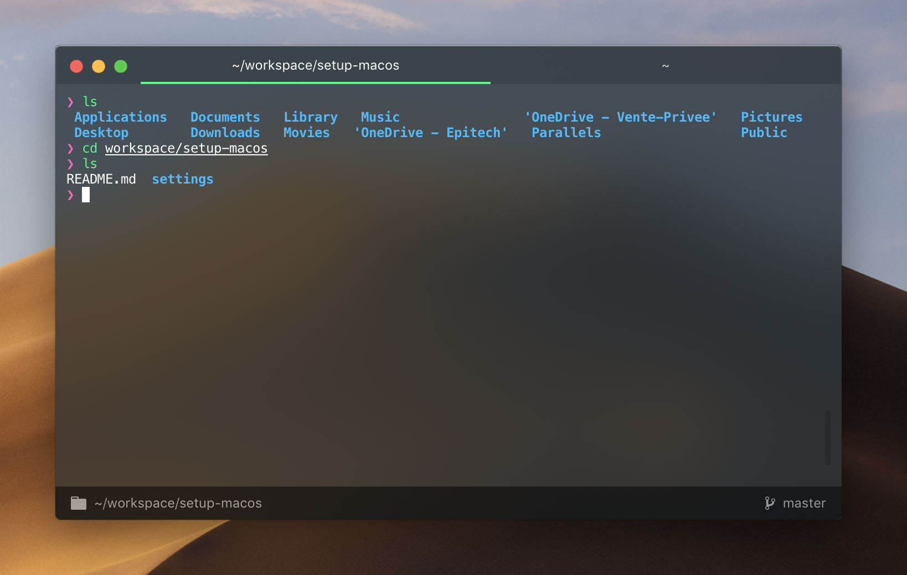

# Hyper Settings



Open `~/.hyper.js`.

## Default window size

```js
// The default width/height in pixels of a new window
windowSize: [760, 480],
```

## Themes

Choose only one theme from this list.

### [hyper-vibrant](https://github.com/nachoaIvarez/hyper-vibrant)

Snazzy inspired hyper theme using the macOS Vibrancy API.

```js
plugins: [
    "hyper-vibrant"
],
```

### [hyper-snazzy](https://github.com/sindresorhus/hyper-snazzy)

Elegant Hyper theme with bright colors.

```js
plugins: [
    "hyper-snazzy",
],
```

### [hyper-chesterish](https://github.com/henrikdahl/hyper-chesterish)

Chesterish Theme for Hyper based on Jupyter schemes.

```js
plugins: [
    "hyper-chesterish",
],
```

## Plugins

### [hypercwd](https://github.com/hharnisc/hypercwd)

Opens new tabs in the same directory as the current tab.

```js
plugins: [
    "hypercwd",
],
```

### [hyper-statusline](https://github.com/henrikdahl/hyper-statusline)

Status line plugin. Shows clickable & useful information (git, current directory). Matches any theme.

```js
plugins: [
    "hyper-statusline",
],
```

### [hyperborder](https://github.com/webmatze/hyperborder)

Adds a gradient border just like in the icon.

```js
plugins: [
    "hyperborder",
],
```
