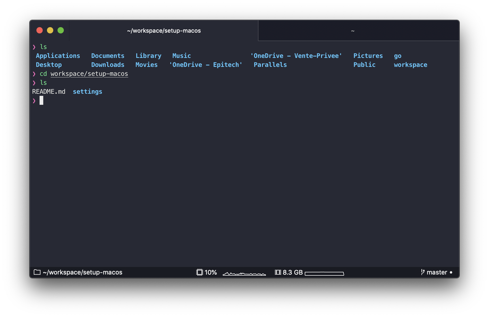
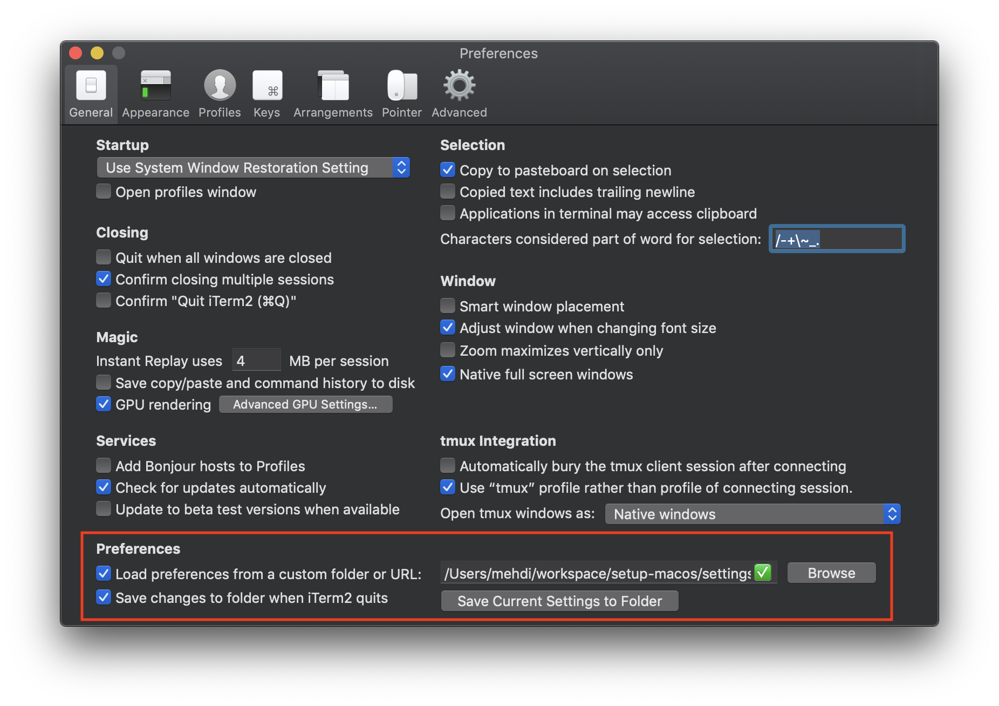
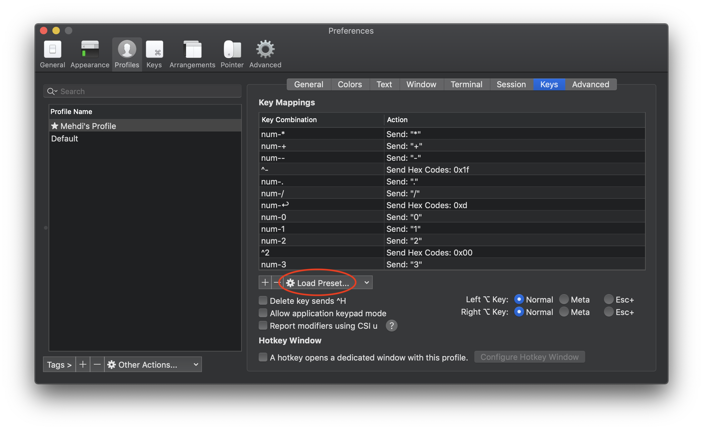

# iTerm2 Settings



## Install iTerm2 nightly builds

Available here: https://www.iterm2.com/downloads/nightly/#/section/home

More information on why in the first article listed in the [Resources](#Resources) section below.

Or stable build if 3.3 is released.

## Load preferences file

Load preferences from this URL: `https://raw.githubusercontent.com/imkh/setup-macos/master/settings/iterm2/com.googlecode.iterm2.plist`



## Disable Last Login message

```console
$ touch ~/.hushlogin
```

## Enable word jumps and word deletion

To enable word jumps (option + → or ←) and word deletions (option + backspace), go to **iTerm → Preferences → Profiles → Keys → Load Preset... → Natural Text Editing**.



## Themes

- [iterm2-snazzy](https://github.com/sindresorhus/iterm2-snazzy)
- [material-design-colors](https://github.com/MartinSeeler/iterm2-material-design)
- [One Dark](https://github.com/joshdick/onedark.vim/blob/master/term/One%20Dark.itermcolors)

## Resources

- [Pretty iTerm2 with a modern titlebar 💄💅](https://www.felixjung.io/posts/pretty-iterm2-with-a-modern-titlebar/)
- [Custom iTerm2 titlebar background colors](https://codematters.blog/custom-iterm2-titlebar-background-colors-a088c6f2ec60)
- [setting terminal tab title](https://github.com/robbyrussell/oh-my-zsh/issues/5700)
- [Set the title of the terminal window to the current directory](https://superuser.com/questions/79972/set-the-title-of-the-terminal-window-to-the-current-directory)
- [Use PROMPT_COMMAND to set titles on iTerm tabs ](http://hints.macworld.com/article.php?story=20031015173932306)